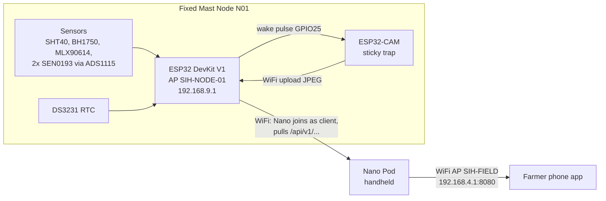
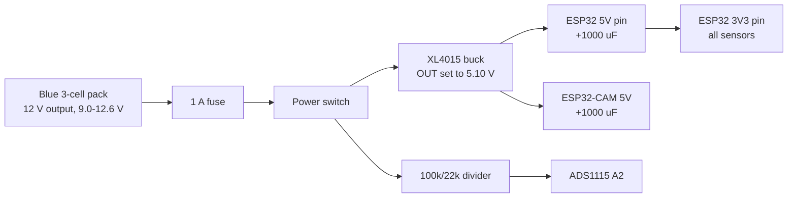
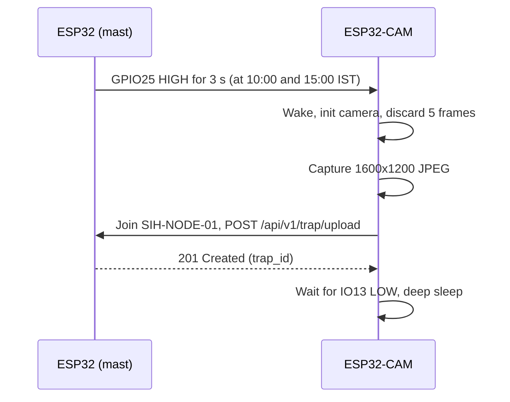

# SIH 2026 — Hardware Build & Wiring Guide

2026-09-17 · @Someone

## 0. Status, scope and blocking questions

This guide is the single wiring and firmware reference for the **Fixed Mast Node (N01, ESP32)** and, secondarily, the **Nano Pod (handheld)**. It follows the architecture settled on 12 Sep 2026: two devices, all WiFi, no LoRa, no drone, no actuation. Where this guide disagrees with `Hardware_for_nodes.md` (7 Sep), this guide wins.

### What changed since the 7 Sep hardware notes

| Old (7 Sep notes) | Now (this guide) | Why it matters |
| --- | --- | --- |
| LoRa SX1278 radio on the mast | **No LoRa.** Mast runs its own WiFi AP `SIH-NODE-01`; the Nano Pod connects to it and pulls data | No radio module to wire; ESP32 WiFi does everything |
| MLX90640 thermal array on a mast boom | **MLX90640 is on the handheld Nano Pod.** Mast keeps only the MLX90614 point sensor | No 1.2 m boom needed. Mast IR is trend data only, never CWSI |
| SHT31 air temp/RH | **SHT40** (what was ordered) | Same I²C address 0x44, different library |
| JSN-SR04T water level | **Dropped** | Paddy AWD stays open-loop; `WATER_LEVEL_SENSOR_PRESENT` stays `False` |
| Rain gauge (`mast_rain` in the app contract) | **Dropped: rain is not measured** | App/software must remove `mast_rain` from `inputs[]` |
| Solar panel + charge controller + 12 V SLA | **Blue 3-cell Li-ion pack with 4 / 8 / 12 V outputs, used at 12 V.** No solar | Node runs about one day per charge (see §3) |
| LM2596 buck | **XL4015 5 A buck** (input up to \~38 V) | One trim-pot sets the output voltage |
| Solenoid, relay, flow meter | Dropped on 7 Sep, still dropped | Advisory only; the farmer irrigates |

### Confirmed hardware (17 Sep 2026)

| Item | Confirmed part | Consequence |
| --- | --- | --- |
| Mast MCU | 38-pin ESP32 DevKit V1 (ESP32-WROOM-32, back silkscreen "NodeMCU ESP-32S V1.1") | Power goes into the pin labelled **5V** (there is no "VIN" label on this board) |
| Trap camera | ESP32-CAM (ESP-32S module) with **OV2640** sensor | Firmware reports `OV2640`; calibrate on this exact module |
| Mast battery | Blue 3-cell Li-ion pack, male barrel output plug, female barrel charging socket, 3-pin tap connector, selectable 4 / 8 / 12 V | Use the **12 V** output only (§3) |
| Mast buck | XL4015 5 A | Set to 5.10 V before connecting loads |
| Mast enclosure, pole, glands | Bought later, locally | Stage 6 of §7 waits for them |
| Rain gauge | Not used | `mast_rain` removed |
| Nano WiFi | Atheros **AR9271-P** USB dongle (Wavenex) | AC8265 M.2 card is out |
| Nano RGB camera | **Official Raspberry Pi Camera Module V2** (Sony IMX219, 3280×2464, fixed focus), Robu SKU 128023 | Software's V2 lens values (62.2° H FOV) are correct |

### Settled on 17 Sep 2026

- **Battery charging:** through the pack's own **female 5.5×2.1 mm barrel socket**. Power for the node comes from the pack's **male barrel plug**. See §3.
- **Node WiFi password:** `sih12345`. The requested `sih123` cannot be used: WPA2 needs at least 8 characters, and the ESP32 refuses to start the access point with a shorter password. The same value goes into the mast firmware, the camera firmware and the Nano collector config.
- **Nano power parts:** EAGLE-101 carrier, PDC004 PD trigger, XL4015 5 A buck with barrel lead, all on the parts list (§8).

### Small parts not on the order list (buy offline)

| Part | Qty | Used for |
| --- | --- | --- |
| 100 kΩ and 22 kΩ resistors (1 % if possible) | 1 each | Battery voltage divider into ADS1115 A2 |
| 1 kΩ resistor | 1 | Series resistor on the camera wake line |
| 1000 µF 10 V (or 16 V) electrolytic capacitor | 2 | 5 V rail buffer at the ESP32-CAM and at the ESP32 |
| 100 nF ceramic capacitor | 3 | Decoupling at the end of each long I²C cable |
| 4-core shielded cable or CAT5/CAT6 | 3–4 m | I²C runs to SHT40 and MLX90614 |
| 3-core shielded cable | 3 m | Soil probe extensions |
| 1 A inline blade fuse + holder | 1 | Battery positive lead |
| SPST rocker switch | 1 | Main power switch |
| JST-XH / screw terminal blocks, heat-shrink, silicone sealant | assorted | Connections and waterproofing |
| Clear acrylic sheet or dome | 1 | Window for the BH1750 and the ESP32-CAM lens |

## 1. System architecture

The mast node is a dumb, reliable data logger: it measures, timestamps, stores and serves raw values. All maths (VPD, soil moisture %, pest counts, CWSI, advisories) happens on the Nano Pod.



The Nano Pod uses one WiFi dongle and switches modes: it drops its own AP, joins `SIH-NODE-01`, pulls data, then brings `SIH-FIELD` back (about 20–30 s).

### Who does what

| Device | Role | Never does |
| --- | --- | --- |
| ESP32 DevKit V1 (mast) | Samples sensors every 10 min, keeps time (DS3231), stores records and trap images in flash, runs WiFi AP + HTTP API, wakes the ESP32-CAM twice a day | Any calculation beyond unit conversion; any inference |
| ESP32-CAM (mast) | Sleeps; on wake takes one sticky-card photo and uploads it to the ESP32 | Counting insects, storing images long-term, keeping time |
| Nano Pod (handheld) | Pulls mast data, sets the mast clock from GPS, runs AI + agronomy, measures CWSI with the MLX90640, serves the phone app | Being left in the field unattended |
| Phone app | Shows advisories from the Nano Pod | Talking to the mast directly |

### Fixed network values (do not change without telling the app and software teams)

| Item | Value |
| --- | --- |
| Mast AP SSID / password | `SIH-NODE-01` / `sih12345` |
| Mast IP / subnet | `192.168.9.1` / `255.255.255.0` |
| Mast API base | `http://192.168.9.1/api/v1/` (port 80) |
| ESP32-CAM address | DHCP from the mast (no static IP needed) |
| Nano Pod AP | `SIH-FIELD`, `192.168.4.1`, port 8080 |
| IDs | `node_id` = `N01`, `field_id` = `F01`, camera = `N01-CAM`; Nano data uses `POD` |
| Time | All timestamps UTC, ISO 8601 with trailing `Z` |

The mast is on 192.168.9.x on purpose: the ESP32 default 192.168.4.1 would collide with the Nano Pod's AP address.

## 2. Mast node: parts and what each one does

Every part below is on the order list except where marked. The "Output" column is exactly what the firmware sends to the Nano Pod.

| Part | Model | Measures / does | Mounted where | Interface | Output field(s) |
| --- | --- | --- | --- | --- | --- |
| Main MCU | ESP32 DevKit V1, 38-pin (ESP32-WROOM-32) | Brain: sampling, clock, storage, WiFi AP, HTTP API | Inside enclosure | — | `node_id`, `fw_version` |
| Air temp + humidity | SHT40 breakout | Air temperature and relative humidity for VPD and ET₀ | In radiation shield, at canopy height, in open air | I²C 0x44 | `air_temp_c`, `rh_pct` |
| Radiation shield | DIY (stacked white cups/saucers or PVC) | Keeps sun and rain off the SHT40, lets air flow | Around the SHT40 | — | — |
| Canopy IR (point) | MLX90614ESF-BAA (GY-906 board) | Canopy surface temperature **trend** only. Not CWSI | Short arm, looking down at canopy | I²C 0x5A | `ir_object_c`, `ir_ambient_c` |
| Light | BH1750 (GY-302) | Illuminance; used by the Nano as a clear-sky gate | Top of pole, facing sky, under clear window | I²C 0x23 | `lux` |
| ADC | ADS1115 16-bit | Converts soil probe and battery voltages to numbers | Inside enclosure | I²C 0x48 | (used by the two rows below) |
| Soil moisture ×2 | SEN0193 capacitive | Relative soil wetness (raw volts; Nano converts to %) | Buried 15–20 cm, 1 m from pole, outside its shadow | Analog → ADS1115 A0, A1 | `soil_v` \[A0, A1\] |
| Battery monitor | 100 kΩ / 22 kΩ divider (buy offline) | Pack voltage | Inside enclosure | Analog → ADS1115 A2 | `battery_v` |
| Real-time clock | DS3231 + AT24C32 (ZS-042) with CR2032 | Keeps UTC time when power is off | Inside enclosure | I²C 0x68 (EEPROM 0x57, unused) | `utc`, `rtc_valid` |
| Trap camera | ESP32-CAM, AI-Thinker layout (OV2640) | Photographs the sticky card twice a day | In its own small box, facing the card at a fixed distance | WiFi to main ESP32 + 1 wake wire | trap image + metadata |
| Programmer | ESP32-CAM-MB | USB flashing of the ESP32-CAM (bench only) | Not deployed | USB | — |
| Sticky trap | Yellow sticky card (large) with printed ArUco markers | Catches flying pests | At canopy top +10–30 cm, opposite side of the pole from the IR arm | — | — |
| Power | Blue 3-cell Li-ion pack on its 12 V setting + XL4015 buck to 5 V | Powers everything | Inside enclosure, away from the ESP32-CAM | — | `battery_v` |

### I²C address check (no conflicts)

| Address | Device |
| --- | --- |
| 0x23 | BH1750 (ADDR pin to GND or open) |
| 0x44 | SHT40 |
| 0x48 | ADS1115 (ADDR pin to GND) |
| 0x57 | AT24C32 EEPROM on the RTC board (not used) |
| 0x5A | MLX90614 |
| 0x68 | DS3231 |

The MLX90640 (0x33) is **not** on this bus; it lives on the Nano Pod. Never tie BH1750 ADDR to 3.3 V (that moves it to 0x5C, which the firmware does not scan for).

## 3. Mast node: power system

One rail design: battery → fuse → switch → buck set to **5.10 V** → ESP32 5V pin and ESP32-CAM 5V. All sensors run on **3.3 V from the ESP32's 3V3 pin**. Nothing on this node runs at 12 V except the battery leads and the buck input. The blue pack is used on its 12 V setting: three Li-ion cells in series, about 9.0 V empty to 12.6 V full.



### Power wiring, step by step

1. **Know the pack's two barrels.** The **male plug** (pin sticking out) is the power **output**. The **female socket** is the **charging input**. Set the pack to 12 V and measure the male plug with a multimeter: it must read 9.0–12.6 V, centre pin positive. Label both leads with tape ("OUT" and "CHARGE").
2. Take power from the male plug using a **female 5.5×2.1 mm barrel pigtail** (do not cut the pack's lead). Pigtail **+** (red, confirm with the meter) → inline 1 A fuse → switch terminal 1. Switch terminal 2 → XL4015 **IN+**. Pigtail **−** → XL4015 **IN−**. Do not take power from the 4 V or 8 V points of the 3-pin lead: that drains the cells unevenly.
3. With **nothing connected to the output**, switch on and turn the XL4015's blue trim-pot (multi-turn; many turns may be needed) until a multimeter reads **5.05–5.15 V** across OUT+ and OUT−. Switch off. This XL4015 has no current-limit pot; the 1 A fuse is the protection.
4. XL4015 **OUT+** → 5 V bus (terminal block). **OUT−** → GND bus (terminal block). This GND bus is the single common ground for everything.
5. 5 V bus → the ESP32 pin labelled **5V** (last pin of the header row that starts with 3V3/EN). GND bus → ESP32 **GND**. Solder a 1000 µF cap across 5V/GND close to the board (stripe = negative to GND).
6. 5 V bus → ESP32-CAM **5V** pin. GND bus → ESP32-CAM **GND**. Second 1000 µF cap right at the camera's 5V/GND pins. The camera is the brownout risk; wires to it should be 22 AWG or thicker and under 50 cm.
7. Battery divider: from **switch terminal 2** (after the switch, so it does not drain the pack when off) → 100 kΩ → junction → 22 kΩ → GND bus. Junction → ADS1115 **A2**. At 12.6 V the junction is 2.27 V, safely below 3.3 V.
8. ESP32 **3V3** pin → 3.3 V sensor bus (terminal block). Every sensor VCC connects here, never to 5 V.

### Charging the pack

- Use only the charger that came with the pack (or a **12.6 V Li-ion** charger with a 5.5×2.1 mm male plug) in the **female CHARGE socket**, with the pack on its 12 V setting.
- Switch the node **off** while charging, and charge on a non-flammable surface where someone can see it. Unplug when the charger shows full.
- Charge every night during the demo period (§3 power budget). Never leave the pack sealed in the enclosure while charging.
- If the pack gets hot, swells or smells, disconnect it and stop using it.

### Rules that prevent damage

- **Never feed 5 V into the ESP32 3V3 pin.** 3V3 is an output only in this design.
- **Never power sensors from 5 V.** The ADS1115 inputs must stay below its own 3.3 V supply +0.3 V. Single documented exception: a SEN0193 probe with an NE555 timer is powered from the 5 V bus, and only after its dry-air AOUT has been measured below 3.3 V (§4).
- **Flashing the ESP32 over USB:** switch the mast power off first. Some DevKit clones have no protection diode between USB 5 V and the 5V pin.
- **Common ground everywhere.** The camera wake wire only works if the ESP32 and ESP32-CAM share GND.
- **Battery and ESP32-CAM apart:** the camera runs warm; keep it out of the battery's compartment.
- **Low battery:** below 9.9 V the firmware stops triggering the camera and flags `LOW_BATTERY`. We do not know whether the pack has a protection board, so never run it below 9.0 V. Do not deep-discharge Li-ion.

### Power budget (estimate, not measured)

| Load | Current at 5 V | Power |
| --- | --- | --- |
| ESP32 with WiFi AP always on | \~110–130 mA | \~0.6 W |
| Sensors (2 × SEN0193 \~5 mA each, rest <3 mA) via ESP32 regulator | \~15 mA | \~0.08 W |
| ESP32-CAM in deep sleep (AI-Thinker boards leak a few mA) | \~3–8 mA | \~0.03 W |
| ESP32-CAM active, \~15 s twice a day (peaks 300–400 mA) | negligible average | <0.01 W |
| Buck converter loss (\~85 % efficient) | — | \~0.12 W |
| **Total from the pack** | — | **\~0.85 W** |

If the three cells are 2000–3000 mAh each (check the cell labels or the seller page), the pack holds about 22–33 Wh; using 80 % of that gives roughly **20–31 hours**. The node is therefore a **charge-every-night** device for the demo. For multi-day unattended running we would need a solar panel + 3S solar charger, or a scheduled-AP mode in firmware; neither is in scope now. Measure the real current with a USB/inline meter during bring-up and replace these estimates.

## 4. Mast node: pin map and wiring

The ESP32 uses only **six pins**: 5V, GND, 3V3, GPIO21 (SDA), GPIO22 (SCL) and GPIO25 (camera wake). Every sensor except the soil probes hangs on the one I²C bus; the soil probes go through the ADS1115.

### ESP32 DevKit V1 (38-pin) pin map

Pin names below are as printed on the back of our board ("P21" = GPIO21).

| Board label | Connects to | Notes |
| --- | --- | --- |
| 5V | 5 V bus (XL4015 OUT+) | Last pin of the header row that starts with 3V3/EN, next to CMD (USB end). 1000 µF cap across 5V–GND |
| GND (any) | GND bus | Single common ground |
| 3V3 | 3.3 V sensor bus | Output only; feeds all sensors |
| P21 (GPIO21) | I²C **SDA** bus | Between GND and RX. Firmware runs the bus at 50 kHz |
| P22 (GPIO22) | I²C **SCL** bus | Between TX and P23 |
| P25 (GPIO25) | 1 kΩ resistor → ESP32-CAM **IO13** | Between P33 and P26. Camera wake pulse (HIGH for 3 s) |
| P2 (GPIO2) | Onboard LED | Status blink; no external wiring |

**Do not use:** GPIO6–11 (internal flash), GPIO0/2/5/12/15 for external parts (boot-strapping pins), GPIO34–39 as outputs (input only), any ADC2 pin (GPIO0, 2, 4, 12–15, 25–27) as an analog input (ADC2 does not work while WiFi is on). That is why all analog readings go through the ADS1115.

**Never wire anything to CLK, SD0, SD1, SD2, SD3 or CMD.** On this 38-pin board those six pins are GPIO6–11, the internal flash; touching them crashes or bricks the board.

### I²C bus wiring (all sensors in parallel)

Every I²C device gets the same four wires: **VCC → 3.3 V bus, GND → GND bus, SDA → GPIO21, SCL → GPIO22.**

| Board | Its pin | Goes to | Extra pins |
| --- | --- | --- | --- |
| SHT40 | VIN / VCC | 3.3 V bus | — |
|  | GND | GND bus |  |
|  | SDA | GPIO21 |  |
|  | SCL | GPIO22 |  |
| BH1750 (GY-302) | VCC | 3.3 V bus | **ADDR → GND** (address 0x23) |
|  | GND | GND bus |  |
|  | SDA / SCL | GPIO21 / GPIO22 |  |
| MLX90614 (GY-906) | VIN | 3.3 V bus | — |
|  | GND | GND bus |  |
|  | SDA / SCL | GPIO21 / GPIO22 |  |
| ADS1115 | VDD | 3.3 V bus | **ADDR → GND** (0x48). ALERT unconnected |
|  | GND | GND bus |  |
|  | SDA / SCL | GPIO21 / GPIO22 |  |
| DS3231 (ZS-042) | VCC | 3.3 V bus | SQW and 32K unconnected |
|  | GND | GND bus |  |
|  | SDA / SCL | GPIO21 / GPIO22 |  |

### ADS1115 analog inputs

| ADS1115 pin | Connects to | Signal range |
| --- | --- | --- |
| A0 | Soil probe 1 **AOUT** (signal) | \~1.2 V (wet) to \~2.9 V (dry) |
| A1 | Soil probe 2 **AOUT** | same |
| A2 | Battery divider junction (100 k / 22 k) | 1.6–2.3 V for a 9–12.6 V pack |
| A3 | Unused. Tie to GND | — |

Soil probe power: each SEN0193 **VCC → 3.3 V bus**, **GND → GND bus**. On DFRobot Gravity cables red = VCC, black = GND, blue = signal. **The Electronic Spices board may use different colours: follow the labels printed on the PCB, not the wire colours.**

**Timer chip check (per probe):** Read the 8-pin timer chip on each probe. TLC555 (or marked 'C555' / 'TLC'): power from the 3.3 V bus as written. NE555: power that probe from the 5 V bus instead, but first measure AOUT in dry air with nothing else connected; it must stay below 3.3 V before it is wired to the ADS1115. Record which chip each probe has. (Many clone v1.2-style boards use an NE555, which is not reliable at 3.3 V.)

### Camera wake wire

ESP32 **GPIO25** → 1 kΩ resistor → ESP32-CAM **IO13**. The two boards must share GND. This is the only wire between them; images travel over WiFi. Do not connect any UART, 5 V or 3.3 V between the two boards other than through the power buses.

### Long cable runs (SHT40 and MLX90614)

I²C is designed for short distances. The SHT40 (canopy height) and MLX90614 (on its arm) will be about 1–1.5 m from the enclosure, which works if you follow these rules:

- Use CAT5/CAT6 or 4-core shielded cable, **maximum 2 m** per run.
- CAT5: twist **SDA with GND** in one pair and **SCL with 3.3 V** in another pair. Do not put SDA and SCL in the same pair.
- Solder a **100 nF capacitor** across VCC–GND at the sensor end of each long run.
- Firmware runs the bus at **50 kHz** (the MLX90614 is limited to 100 kHz anyway).
- **Pull-up check:** with power off, measure resistance SDA→3.3 V bus and SCL→3.3 V bus with everything connected. Target **1.5–4.7 kΩ**. Below 1.5 kΩ, too many modules have their own pull-ups: desolder the pull-up resistors from one or two boards (usually the 10 kΩ pair next to the header) and measure again.

### DS3231 coin cell and charging-circuit modification

Our notes say the CR2032 came **pre-installed** on the RTC board. The common ZS-042 DS3231 board has a charging circuit that tries to charge the coin cell, and a CR2032 is not rechargeable. **If a coin cell is already fitted, REMOVE it before the board is powered for the first time. Remove the 200 Ω (201) charging resistor, then refit the CR2032. If it is an LIR2032 (rechargeable), leave the circuit in place.**

## 5. Mast node: ESP32-CAM trap camera

The ESP32-CAM sleeps until the main ESP32 pulses its IO13 pin, then takes one 1600×1200 photo of the sticky card, uploads it over WiFi to `192.168.9.1`, and goes back to sleep. It does no counting; the Nano Pod counts insects.

### Capture sequence



If no image arrives within 90 s, the main ESP32 retries once after 5 minutes and then records `NO_UPLOAD` for that slot.

### ESP32-CAM pins used

| ESP32-CAM pin | Connects to | Notes |
| --- | --- | --- |
| 5V | 5 V bus | 1000 µF cap right at this pin |
| GND | GND bus | Must be common with the main ESP32 |
| IO13 | From ESP32 GPIO25 via 1 kΩ | Wake input (HIGH = wake) |
| IO4 | Nothing (on-board flash LED) | Firmware holds it OFF; the flash causes glare on the glossy card |
| IO0, U0R, U0T | Nothing in the field | Used only on the MB programmer |
| IO16 | **Never use** | It is the PSRAM chip select |
| 3V3 | **Do not connect** | Board makes its own 3.3 V from 5V |

No microSD card is needed. Leave the slot empty.

### Flashing with the ESP32-CAM-MB

1. Plug the ESP32-CAM onto the MB board (antenna/camera side facing away from the USB connector, pins fully seated). Connect MB to the laptop with a **data** micro-USB cable.
2. macOS usually has the CH340 driver built in. Check the port appears: `ls /dev/cu.*` should show something like `/dev/cu.usbserial-XXXX` or `/dev/cu.wchusbserial-XXXX`.
3. Arduino IDE: board **AI Thinker ESP32-CAM** (esp32 core **2.0.17**), Partition Scheme **Huge APP (3MB No OTA)**, Upload Speed **115200**.
4. If upload stays on `Connecting....`: hold **IO0** on the MB, tap **RST**, release IO0, and upload again.
5. After upload, tap **RST** and open Serial Monitor at **115200**. On first power-on the firmware takes one test photo and tries to upload it; with the mast off you will see `upload FAILED` and then `sleeping`. That is correct.
6. Remove the camera from the MB before wiring it into the mast. The MB is never deployed.

### Mounting and calibration (needed by the Nano software)

- Fix the camera **square to the card**, lens centred on the card, at a fixed distance. With the stock lens (\~66° diagonal) a 25 cm-wide card roughly fills the frame at about **20–25 cm**. Adjust until the whole card plus its four ArUco markers are in frame with a small margin.
- Put the lens behind a clear acrylic window, angled slightly so it does not reflect the lens back into the image. Shade the card from direct sun where possible to reduce glare.
- **Once calibrated, nothing may move:** distance, angle, lens, and resolution (always 1600×1200). Any change invalidates `MM_PER_PIXEL`.
- **Ruler photo (HUMAN\_ACTIONS row 1):** tape a metric ruler flat on the card surface, trigger a manual capture (`POST /api/v1/trap/trigger`, §6), download the image, and send it to the software team to compute `MM_PER_PIXEL`.
- **Marker spacing (row 2):** measure the ArUco marker centre-to-centre spacing on the printed card with calipers and send both numbers (width and height, mm). The software currently assumes 80.0 × 55.0 mm.
- Replace the sticky card every few days. Mount the trap on a hinged or sliding arm so it can be reached from the ground, and re-check framing after each swap.

## 6. Mast node: firmware

Two sketches run on the mast: **`node_n01.ino`** on the ESP32 DevKit and **`esp32cam_trap.ino`** on the ESP32-CAM. Both are reference firmware written for this guide: **they have not yet been compiled or bench-tested.** A clean compile is the first bring-up step (§7); send any compiler errors back to the software side before changing logic.

Repo locations: `firmware/node_n01/node_n01.ino` and `firmware/esp32cam_trap/esp32cam_trap.ino`. This replaces the older checklist plan where the camera posted to a separate gateway with its own timestamp: now the mast ESP32 receives the image and stamps it from the DS3231.

### Toolchain (use exactly these)

| Item | Main node (ESP32 DevKit) | Trap camera (ESP32-CAM) |
| --- | --- | --- |
| Arduino board package | esp32 by Espressif, **2.0.17** | same |
| Board | ESP32 Dev Module | AI Thinker ESP32-CAM |
| Partition scheme | **No OTA (2MB APP/2MB SPIFFS)** | **Huge APP (3MB No OTA)** |
| Upload speed | 921600 (drop to 115200 if it fails) | 115200 |
| Libraries (Library Manager) | Adafruit SHT4x Library, Adafruit ADS1X15, Adafruit MLX90614 Library, BH1750 (Christopher Laws), RTClib (Adafruit), ArduinoJson **7.x** | none beyond the board package |

Do not use board package 3.x: the watchdog API changed and the code below targets 2.0.17.

### What the main node firmware does

1. **Boot:** camera wake pin forced LOW, flash filesystem mounted, sensors initialised (a missing sensor is logged as `ERR`, never fatal), RTC checked, AP `SIH-NODE-01` started at 192.168.9.1, 30 s watchdog armed.
2. **Every 10 minutes:** read all sensors, build one JSON record with a sequence number (`seq`), append it to flash. Failed sensors are re-initialised and reported as `null`.
3. **Twice a day** (04:30 and 09:30 UTC = 10:00 and 15:00 IST), only if the RTC is valid and battery is above 9.9 V: pulse the camera, wait up to 90 s for the upload, retry once after 5 min.
4. **Always:** serve the HTTP API below.

Storage limits (4 MB flash): records rotate at 200 kB × 2 files (about 11 days at 10 min), and only the **last 3 trap images** are kept (max 450 kB each). The Nano Pod must collect at least every few days.

### Record format (one per 10-minute sample)

```json
{"seq":1234,"node_id":"N01","field_id":"F01","utc":"2026-09-17T06:30:00Z",
 "rtc_valid":true,"uptime_s":36012,
 "air_temp_c":31.42,"rh_pct":58.10,
 "ir_object_c":29.85,"ir_ambient_c":33.10,
 "lux":84210.5,"soil1_v":2.1043,"soil2_v":1.9876,"battery_v":11.62,
 "status":{"sht40":"OK","mlx90614":"OK","bh1750":"OK","ads1115":"OK","rtc":"OK"}}
```

Rules: raw values only (the Nano computes VPD, soil %, everything else); any failed reading is `null`, never 0 or a guess; `utc` is UTC with `Z`; if `rtc_valid` is `false` the Nano must treat `utc` as untrusted.

### HTTP API served by the mast (base `http://192.168.9.1/api/v1/`)

| Method + path | Who calls it | Returns |
| --- | --- | --- |
| `GET /health` | Nano | node/firmware IDs, `utc`, `rtc_valid`, `battery_v`, `last_seq`, `log_epoch`, sensor OK/ERR, trap status, flash usage, connected clients |
| `GET /readings?since=<seq>&limit=<n>` | Nano | `{"records":[…],"count","next_since","truncated"}`. Records with `seq` **greater than** `since`, ascending, max 500 per call. If `truncated` is true, call again with `since=next_since` |
| `GET /trap/list` | Nano | metadata of the stored trap images (up to 3) |
| `GET /trap/latest` | Nano | metadata of the newest image |
| `GET /trap/image?id=<trap_id>` | Nano | the JPEG |
| `POST /trap/trigger` | Nano or a laptop (bench, ruler photo) | 202 if a capture was started, 409 if one is already running |
| `POST /time?utc=<unix seconds>` | Nano, from valid GPS time only | sets the DS3231, makes `rtc_valid` true |
| `POST /trap/upload` | ESP32-CAM only | 201 + metadata. Rejects other devices (403), empty (400) or oversize (413) images |

**Nano collector rule:** store `log_epoch` from `/health`. If it ever changes, the mast's flash was wiped and `seq` restarted, so reset the cursor to 0. Only call `/time` when the Nano's own GPS fix and time are valid; a wrong time here corrupts every later timestamp.

**Data flow note:** The mast never pushes sensor data. The Nano Pod pulls `/readings` and `/trap/image`. The Nano-side collector (`edge/mast_collector.py`) and trap processing (`edge/trap_job.py`) are software-side work and are not built yet. The field names in the record format above are the contract; there is no rain field.

Bench shortcut: the serial monitor (115200) on the main ESP32 accepts `H` (print health), `S` (sample now), `C` (capture now) and `T<unix seconds>` (set clock).

### Listing A: `firmware/node_n01/node_n01.ino` (rev 2, still not compiled or bench-tested)

```cpp
/*
 * node_n01.ino - SIH 2026 Fixed Mast Node N01 (ESP32 DevKit V1)
 * Core: esp32 2.0.17 | Board: ESP32 Dev Module | Partition: No OTA (2MB APP/2MB SPIFFS)
 * Libs: Adafruit SHT4x, Adafruit ADS1X15, Adafruit MLX90614, BH1750 (claws),
 *       RTClib (Adafruit), ArduinoJson 7.x
 * STATUS: reference firmware rev 2, still NOT compiled or bench-tested.
 */
#include <WiFi.h>
#include <WebServer.h>
#include <Wire.h>
#include <LittleFS.h>
#include <Preferences.h>
#include <ArduinoJson.h>
#include <RTClib.h>
#include <Adafruit_SHT4x.h>
#include <Adafruit_ADS1X15.h>
#include <Adafruit_MLX90614.h>
#include <BH1750.h>
#include <esp_task_wdt.h>

// ================= CONFIGURATION =================
#define FW_VERSION "n01-1.0.0"
const char* NODE_ID   = "N01";
const char* FIELD_ID  = "F01";
const char* CAM_ID    = "N01-CAM";
const char* AP_SSID   = "SIH-NODE-01";
const char* AP_PASS   = "sih12345";          // must match Nano collector + camera
const IPAddress AP_IP(192, 168, 9, 1);
const IPAddress AP_MASK(255, 255, 255, 0);

const int PIN_SDA = 21, PIN_SCL = 22, PIN_CAM_WAKE = 25, PIN_LED = 2;
const uint32_t I2C_HZ = 50000;                  // slow bus for long cables

const uint32_t SAMPLE_INTERVAL_MS = 10UL * 60UL * 1000UL;   // 10 min
const int   ADS_AVG      = 8;
const float BATT_DIVIDER = (100.0f + 22.0f) / 22.0f;        // tune against a multimeter
const float BATT_LOW_V   = 9.9f;

// Trap capture slots in UTC: 04:30Z = 10:00 IST, 09:30Z = 15:00 IST
const uint8_t TRAP_SLOTS[][2] = {{4, 30}, {9, 30}};
const int      N_SLOTS        = 2;
const uint32_t CAM_PULSE_MS   = 3000;
const uint32_t UPLOAD_WAIT_MS = 90000;
const uint32_t RETRY_DELAY_MS = 5UL * 60UL * 1000UL;

const size_t MAX_JPEG_BYTES   = 450000;
const int    MAX_TRAP_IMAGES  = 3;
const size_t LOG_ROTATE_BYTES = 200000;
const char*  LOG_CUR = "/log_cur.jsonl";
const char*  LOG_OLD = "/log_old.jsonl";
const char*  UP_TMP  = "/trap/upload.tmp";
const int    MAX_RECORDS_PER_REQ = 500;

// ================= GLOBALS =================
WebServer server(80);
Preferences prefs;
RTC_DS3231 rtc;
Adafruit_SHT4x sht4;
Adafruit_ADS1115 ads;
Adafruit_MLX90614 mlx;
BH1750 lightMeter;

bool okSht = false, okAds = false, okMlx = false, okBh = false, okRtc = false;
bool rtcValid = false;
float lastBattV = NAN;
uint32_t lastSampleMs = 0;
uint32_t logEpoch = 0;

enum CamState { CAM_IDLE, CAM_PULSING, CAM_WAITING, CAM_RETRY_WAIT };
CamState camState = CAM_IDLE;
uint32_t camT0 = 0;
bool camRetried = false;
bool camManual = false;
String trapStatus = "NONE";   // NONE | OK | NO_UPLOAD | RTC_INVALID | LOW_BATTERY

File upFile;
size_t upBytes = 0;
int upError = 0;              // 0 ok, 1 too big, 2 no space, 3 fs error, 4 unknown device

// ================= HELPERS =================
String isoNow() {
  DateTime t = rtc.now();
  char b[25];
  snprintf(b, sizeof(b), "%04d-%02d-%02dT%02d:%02d:%02dZ",
           t.year(), t.month(), t.day(), t.hour(), t.minute(), t.second());
  return String(b);
}

void putUtc(JsonDocument& d, const char* key) {
  if (okRtc) d[key] = isoNow(); else d[key] = nullptr;
}

void putNum(JsonDocument& d, const char* key, float v, int dec) {
  if (isnan(v)) d[key] = nullptr;
  else d[key] = serialized(String(v, dec));
}

const char* okStr(bool ok) { return ok ? "OK" : "ERR"; }

const char* camStateName() {
  switch (camState) {
    case CAM_PULSING:    return "PULSING";
    case CAM_WAITING:    return "WAITING_UPLOAD";
    case CAM_RETRY_WAIT: return "RETRY_WAIT";
    default:             return "IDLE";
  }
}

void sendJson(int code, JsonDocument& d) {
  String out;
  serializeJson(d, out);
  server.send(code, "application/json", out);
}

void sendErr(int code, const char* msg) {
  JsonDocument d;
  d["error"] = msg;
  sendJson(code, d);
}

uint32_t parseSeq(const String& line) {
  if (!line.startsWith("{\"seq\":")) return 0;
  return strtoul(line.c_str() + 7, nullptr, 10);
}

// ================= SENSORS =================
void initSensors() {
  if (!okSht) {
    okSht = sht4.begin(&Wire);
    if (okSht) { sht4.setPrecision(SHT4X_HIGH_PRECISION); sht4.setHeater(SHT4X_NO_HEATER); }
  }
  if (!okAds) {
    okAds = ads.begin(0x48, &Wire);
    if (okAds) ads.setGain(GAIN_ONE);                 // +/-4.096 V range
  }
  if (!okMlx) okMlx = mlx.begin();
  if (!okBh) {
    okBh = lightMeter.begin(BH1750::CONTINUOUS_HIGH_RES_MODE, 0x23, &Wire);
    if (okBh) lightMeter.setMTreg(31);                // extends range to full sunlight
  }
  if (!okRtc) okRtc = rtc.begin(&Wire);
  Wire.setClock(I2C_HZ);
}

float readAdsVolts(int ch) {
  if (!okAds) return NAN;
  long sum = 0;
  for (int i = 0; i < ADS_AVG; i++) sum += ads.readADC_SingleEnded(ch);
  return ads.computeVolts((int16_t)(sum / ADS_AVG));
}

void takeSample() {
  initSensors();                                      // re-tries anything that failed
  JsonDocument d;
  uint32_t seq = prefs.getUInt("seq", 0) + 1;
  d["seq"] = seq;                                     // MUST stay the first key
  d["node_id"] = NODE_ID;
  d["field_id"] = FIELD_ID;
  putUtc(d, "utc");
  d["rtc_valid"] = rtcValid;
  d["uptime_s"] = millis() / 1000;

  sensors_event_t hum, temp;
  if (okSht && sht4.getEvent(&hum, &temp)) {
    putNum(d, "air_temp_c", temp.temperature, 2);
    putNum(d, "rh_pct", hum.relative_humidity, 2);
  } else { okSht = false; d["air_temp_c"] = nullptr; d["rh_pct"] = nullptr; }

  float irObj = NAN, irAmb = NAN;
  if (okMlx) {
    irObj = mlx.readObjectTempC();
    irAmb = mlx.readAmbientTempC();
    bool plausible = !isnan(irObj) && !isnan(irAmb) &&
                     irObj > -40 && irObj < 125 && irAmb > -40 && irAmb < 125;
    if (!plausible) { okMlx = false; irObj = NAN; irAmb = NAN; }
  }
  putNum(d, "ir_object_c", irObj, 2);
  putNum(d, "ir_ambient_c", irAmb, 2);

  float lux = NAN;
  if (okBh) {
    lux = lightMeter.readLightLevel();
    if (lux < 0) { okBh = false; lux = NAN; }
  }
  putNum(d, "lux", lux, 1);

  float s1 = readAdsVolts(0), s2 = readAdsVolts(1), vb = readAdsVolts(2);
  if (okAds && (s1 < -0.1 || s1 > 4.0)) { okAds = false; s1 = s2 = vb = NAN; }
  putNum(d, "soil1_v", s1, 4);
  putNum(d, "soil2_v", s2, 4);
  lastBattV = isnan(vb) ? NAN : vb * BATT_DIVIDER;
  putNum(d, "battery_v", lastBattV, 2);

  JsonObject st = d["status"].to<JsonObject>();
  st["sht40"] = okStr(okSht);
  st["mlx90614"] = okStr(okMlx);
  st["bh1750"] = okStr(okBh);
  st["ads1115"] = okStr(okAds);
  st["rtc"] = okRtc ? (rtcValid ? "OK" : "NOT_SET") : "ERR";

  String line;
  serializeJson(d, line);
  File f = LittleFS.open(LOG_CUR, FILE_APPEND);
  if (f) {
    f.print(line); f.print('\n');
    size_t sz = f.size();
    f.close();
    if (sz > LOG_ROTATE_BYTES) {
      LittleFS.remove(LOG_OLD);
      LittleFS.rename(LOG_CUR, LOG_OLD);
    }
    prefs.putUInt("seq", seq);
  } else {
    Serial.println("LOG WRITE FAILED");
  }
  Serial.println(line);
  digitalWrite(PIN_LED, HIGH); delay(50); digitalWrite(PIN_LED, LOW);
}

// ================= TRAP CAMERA CONTROL =================
bool startCapture(bool manual) {
  if (camState != CAM_IDLE) return false;
  camManual = manual;
  digitalWrite(PIN_CAM_WAKE, HIGH);
  camState = CAM_PULSING;
  camT0 = millis();
  Serial.println(manual ? "trap: manual capture" : "trap: scheduled capture");
  return true;
}

void camTick() {
  uint32_t now = millis();
  switch (camState) {
    case CAM_PULSING:
      if (now - camT0 >= CAM_PULSE_MS) {
        digitalWrite(PIN_CAM_WAKE, LOW);
        camState = CAM_WAITING; camT0 = now;
      }
      break;
    case CAM_WAITING:
      if (now - camT0 >= UPLOAD_WAIT_MS) {
        if (!camRetried) { camRetried = true; camState = CAM_RETRY_WAIT; camT0 = now; }
        else { trapStatus = "NO_UPLOAD"; camState = CAM_IDLE; camRetried = false; }
      }
      break;
    case CAM_RETRY_WAIT:
      if (now - camT0 >= RETRY_DELAY_MS) { camState = CAM_IDLE; startCapture(camManual); }
      break;
    default: break;
  }
}

void scheduleTick() {
  static uint32_t lastCheck = 0;
  if (millis() - lastCheck < 30000) return;
  lastCheck = millis();
  if (!okRtc || !rtcValid) {                 // no trusted time -> no automatic captures
    if (trapStatus == "NONE") trapStatus = "RTC_INVALID";
    return;
  }
  DateTime t = rtc.now();
  uint32_t lastKey = prefs.getUInt("trapKey", 0);
  int nowMin = t.hour() * 60 + t.minute();
  for (int i = 0; i < N_SLOTS; i++) {
    uint32_t key = (uint32_t)(t.year() % 100) * 100000UL + t.month() * 1000UL + t.day() * 10UL + i;
    int slotMin = TRAP_SLOTS[i][0] * 60 + TRAP_SLOTS[i][1];
    // 60-minute window so a reboot hours later does not fire an old slot
    if (nowMin >= slotMin && nowMin < slotMin + 60 && key > lastKey) {
      prefs.putUInt("trapKey", key);
      if (!isnan(lastBattV) && lastBattV < BATT_LOW_V) { trapStatus = "LOW_BATTERY"; return; }
      camRetried = false;
      startCapture(false);
      return;
    }
  }
}

void pruneTrapImages(int keep) {
  while (true) {
    int count = 0; uint32_t minId = UINT32_MAX;
    File root = LittleFS.open("/trap");
    File f = root.openNextFile();
    while (f) {
      String n = f.name();                   // e.g. "T12.jpg"
      if (n.startsWith("T") && n.endsWith(".jpg")) {
        uint32_t id = strtoul(n.c_str() + 1, nullptr, 10);
        count++; if (id < minId) minId = id;
      }
      f = root.openNextFile();
    }
    root.close();
    if (count <= keep || minId == UINT32_MAX) return;
    LittleFS.remove("/trap/T" + String(minId) + ".jpg");
    LittleFS.remove("/trap/T" + String(minId) + ".json");
  }
}

// ================= HTTP HANDLERS =================
void hHealth() {
  JsonDocument d;
  d["node_id"] = NODE_ID;
  d["field_id"] = FIELD_ID;
  d["fw_version"] = FW_VERSION;
  d["log_epoch"] = logEpoch;
  putUtc(d, "utc");
  d["rtc_valid"] = rtcValid;
  d["uptime_s"] = millis() / 1000;
  putNum(d, "battery_v", lastBattV, 2);
  d["last_seq"] = prefs.getUInt("seq", 0);
  d["sample_interval_s"] = SAMPLE_INTERVAL_MS / 1000;
  JsonObject st = d["sensors"].to<JsonObject>();
  st["sht40"] = okStr(okSht);
  st["mlx90614"] = okStr(okMlx);
  st["bh1750"] = okStr(okBh);
  st["ads1115"] = okStr(okAds);
  st["rtc"] = okRtc ? (rtcValid ? "OK" : "NOT_SET") : "ERR";
  JsonObject tr = d["trap"].to<JsonObject>();
  tr["status"] = trapStatus;
  tr["cam_state"] = camStateName();
  tr["last_trap_id"] = prefs.getUInt("trapId", 0);
  d["fs_used_b"] = LittleFS.usedBytes();
  d["fs_total_b"] = LittleFS.totalBytes();
  d["wifi_clients"] = WiFi.softAPgetStationNum();
  sendJson(200, d);
}

void hReadings() {
  uint32_t since = server.hasArg("since") ? strtoul(server.arg("since").c_str(), nullptr, 10) : 0;
  int limit = server.hasArg("limit") ? server.arg("limit").toInt() : MAX_RECORDS_PER_REQ;
  if (limit <= 0 || limit > MAX_RECORDS_PER_REQ) limit = MAX_RECORDS_PER_REQ;

  server.setContentLength(CONTENT_LENGTH_UNKNOWN);
  server.send(200, "application/json", "");
  server.sendContent(String("{\"node_id\":\"") + NODE_ID + "\",\"log_epoch\":" + String(logEpoch) + ",\"records\":[");
  int n = 0; uint32_t lastSeq = since; bool more = false; bool first = true;
  const char* files[2] = {LOG_OLD, LOG_CUR};           // oldest first -> ascending seq
  for (int k = 0; k < 2 && !more; k++) {
    File fh = LittleFS.open(files[k], FILE_READ);
    if (!fh) continue;
    while (fh.available()) {
      String line = fh.readStringUntil('\n');
      uint32_t s = parseSeq(line);
      if (s == 0 || s <= since) continue;
      if (n >= limit) { more = true; break; }
      if (!first) server.sendContent(",");
      first = false;
      server.sendContent(line);
      n++; lastSeq = s;
      esp_task_wdt_reset();
    }
    fh.close();
  }
  server.sendContent("],\"count\":" + String(n) + ",\"next_since\":" + String(lastSeq) +
                     ",\"truncated\":" + (more ? "true" : "false") + "}");
  server.sendContent("");                               // end of chunked response
}

void hTrapList() {
  JsonDocument d;
  JsonArray arr = d["images"].to<JsonArray>();
  File root = LittleFS.open("/trap");
  File f = root.openNextFile();
  while (f) {
    String n = f.name();
    if (n.endsWith(".json")) {
      JsonDocument m;
      if (!deserializeJson(m, f)) arr.add(m);
    }
    f = root.openNextFile();
  }
  root.close();
  sendJson(200, d);
}

void hTrapLatest() {
  uint32_t id = prefs.getUInt("trapId", 0);
  File f = LittleFS.open("/trap/T" + String(id) + ".json", FILE_READ);
  if (id == 0 || !f) { sendErr(404, "no trap image yet"); return; }
  server.streamFile(f, "application/json");
  f.close();
}

void hTrapImage() {
  if (!server.hasArg("id")) { sendErr(400, "missing id"); return; }
  String path = "/trap/T" + String(strtoul(server.arg("id").c_str(), nullptr, 10)) + ".jpg";
  File f = LittleFS.open(path, FILE_READ);
  if (!f) { sendErr(404, "image not found"); return; }
  server.streamFile(f, "image/jpeg");
  f.close();
}

void hTrapTrigger() {
  if (startCapture(true)) {
    camRetried = true;                                 // manual captures do not auto-retry
    JsonDocument d; d["started"] = true; sendJson(202, d);
  } else sendErr(409, "capture already in progress");
}

void hTime() {
  if (!server.hasArg("utc")) { sendErr(400, "missing utc"); return; }
  uint32_t e = strtoul(server.arg("utc").c_str(), nullptr, 10);
  if (e < 1735689600UL || e > 4102444800UL) { sendErr(400, "implausible time"); return; }
  if (!okRtc) { sendErr(503, "rtc not found"); return; }
  rtc.adjust(DateTime(e));                             // also clears the lost-power flag
  rtcValid = true;
  if (trapStatus == "RTC_INVALID") trapStatus = "NONE";
  JsonDocument d;
  d["ok"] = true; putUtc(d, "utc"); d["rtc_valid"] = true;
  sendJson(200, d);
}

void hUploadChunk() {
  HTTPUpload& u = server.upload();
  if (u.status == UPLOAD_FILE_START) {
    upBytes = 0; upError = 0;
    if (server.header("X-Device-Id") != CAM_ID) {   // unauthorised: open no file, prune nothing
      upError = 4;
      return;
    }
    pruneTrapImages(MAX_TRAP_IMAGES - 1);             // authorised only; must stay before the write (flash is tight)
    LittleFS.remove(UP_TMP);
    if (LittleFS.totalBytes() - LittleFS.usedBytes() < MAX_JPEG_BYTES + 20000) upError = 2;
    else { upFile = LittleFS.open(UP_TMP, FILE_WRITE); if (!upFile) upError = 3; }
  } else if (u.status == UPLOAD_FILE_WRITE) {
    upBytes += u.currentSize;
    if (upBytes > MAX_JPEG_BYTES) upError = 1;
    if (upError == 0 && upFile) upFile.write(u.buf, u.currentSize);
    esp_task_wdt_reset();
  } else if (u.status == UPLOAD_FILE_END || u.status == UPLOAD_FILE_ABORTED) {
    if (upFile) upFile.close();
    if (u.status == UPLOAD_FILE_ABORTED) upError = 3;
  }
}

void hUploadDone() {
  if (upError == 4 || server.header("X-Device-Id") != CAM_ID) { sendErr(403, "unknown device"); return; }
  if (upError == 1) { LittleFS.remove(UP_TMP); sendErr(413, "image too large"); return; }
  if (upError != 0 || upBytes == 0) { LittleFS.remove(UP_TMP); sendErr(400, "upload failed"); return; }

  uint32_t id = prefs.getUInt("trapId", 0) + 1;
  String jp = "/trap/T" + String(id) + ".jpg";
  String js = "/trap/T" + String(id) + ".json";
  if (!LittleFS.rename(UP_TMP, jp)) { sendErr(500, "store failed"); return; }

  JsonDocument m;
  m["trap_id"] = id;
  m["node_id"] = NODE_ID;
  putUtc(m, "received_utc");
  m["rtc_valid"] = rtcValid;
  m["bytes"] = upBytes;
  m["sensor"] = server.header("X-Sensor");
  m["frame"] = server.header("X-Frame");
  m["cam_wake"] = server.header("X-Wake");
  m["trigger"] = (camState == CAM_IDLE) ? "unsolicited" : (camManual ? "manual" : "scheduled");
  File f = LittleFS.open(js, FILE_WRITE);
  if (f) { serializeJson(m, f); f.close(); }
  prefs.putUInt("trapId", id);

  camState = CAM_IDLE; camRetried = false; trapStatus = "OK";
  sendJson(201, m);
}

// ================= SERIAL BENCH COMMANDS =================
void serialTick() {
  if (!Serial.available()) return;
  String cmd = Serial.readStringUntil('\n');
  cmd.trim();
  if (cmd == "S") takeSample();
  else if (cmd == "C") { if (startCapture(true)) camRetried = true; else Serial.println("busy"); }
  else if (cmd == "H") {
    Serial.printf("rtcOk=%d rtcValid=%d sht=%d ads=%d mlx=%d bh=%d batt=%.2f seq=%u trap=%s cam=%s\n",
                  okRtc, rtcValid, okSht, okAds, okMlx, okBh, lastBattV,
                  prefs.getUInt("seq", 0), trapStatus.c_str(), camStateName());
    if (okRtc) Serial.println(isoNow());
  } else if (cmd.startsWith("T") && okRtc) {
    uint32_t e = strtoul(cmd.c_str() + 1, nullptr, 10);
    if (e > 1735689600UL) { rtc.adjust(DateTime(e)); rtcValid = true; Serial.println("RTC set: " + isoNow()); }
    else Serial.println("bad time");
  }
}

// ================= SETUP / LOOP =================
void setup() {
  pinMode(PIN_CAM_WAKE, OUTPUT);
  digitalWrite(PIN_CAM_WAKE, LOW);                    // camera must never see a stray wake
  pinMode(PIN_LED, OUTPUT);
  Serial.begin(115200);
  delay(300);
  Serial.println("\nSIH mast node " FW_VERSION);

  prefs.begin("n01", false);
  logEpoch = prefs.getUInt("epoch", 0);
  if (logEpoch == 0) { logEpoch = esp_random() | 1; prefs.putUInt("epoch", logEpoch); }

  if (!LittleFS.begin(true)) Serial.println("LittleFS mount FAILED");
  LittleFS.mkdir("/trap");
  LittleFS.remove(UP_TMP);

  Wire.begin(PIN_SDA, PIN_SCL, I2C_HZ);
  initSensors();
  if (okRtc) {
    rtcValid = !rtc.lostPower() && rtc.now().year() >= 2025;
  }
  Serial.printf("sht=%d ads=%d mlx=%d bh=%d rtc=%d rtcValid=%d\n",
                okSht, okAds, okMlx, okBh, okRtc, rtcValid);

  WiFi.mode(WIFI_AP);
  WiFi.softAPConfig(AP_IP, AP_IP, AP_MASK);
  WiFi.softAP(AP_SSID, AP_PASS, 6, 0, 4);             // channel 6, visible, max 4 clients
  Serial.println("AP up: " + WiFi.softAPIP().toString());

  const char* hdrs[] = {"X-Device-Id", "X-Sensor", "X-Frame", "X-Wake"};
  server.collectHeaders(hdrs, 4);
  server.on("/api/v1/health", HTTP_GET, hHealth);
  server.on("/api/v1/readings", HTTP_GET, hReadings);
  server.on("/api/v1/trap/list", HTTP_GET, hTrapList);
  server.on("/api/v1/trap/latest", HTTP_GET, hTrapLatest);
  server.on("/api/v1/trap/image", HTTP_GET, hTrapImage);
  server.on("/api/v1/trap/trigger", HTTP_POST, hTrapTrigger);
  server.on("/api/v1/time", HTTP_POST, hTime);
  server.on("/api/v1/trap/upload", HTTP_POST, hUploadDone, hUploadChunk);
  server.onNotFound([]() { sendErr(404, "not found"); });
  server.begin();

  esp_task_wdt_init(30, true);                          // reboot if the loop hangs 30 s
  esp_task_wdt_add(NULL);

  lastSampleMs = millis() - SAMPLE_INTERVAL_MS + 5000;  // first sample 5 s after boot
}

void loop() {
  esp_task_wdt_reset();
  server.handleClient();
  camTick();
  scheduleTick();
  if (millis() - lastSampleMs >= SAMPLE_INTERVAL_MS) {
    lastSampleMs = millis();
    takeSample();
  }
  serialTick();
  delay(2);
}
```

### Listing B: `firmware/esp32cam_trap/esp32cam_trap.ino`

```cpp
/*
 * esp32cam_trap.ino - SIH 2026 sticky-trap camera N01-CAM (AI-Thinker ESP32-CAM)
 * Core: esp32 2.0.17 | Board: AI Thinker ESP32-CAM | Partition: Huge APP (3MB No OTA)
 * Works with OV2640 or OV3660 modules (auto-detected, reported in X-Sensor).
 * No on-device inference. No timekeeping (the mast ESP32 stamps the time).
 * STATUS: reference firmware, NOT yet compiled or bench-tested.
 */
#include "esp_camera.h"
#include <WiFi.h>
#include "driver/rtc_io.h"

// ================= CONFIGURATION =================
const char* WIFI_SSID  = "SIH-NODE-01";
const char* WIFI_PASS  = "sih12345";          // must match node_n01.ino
const char* NODE_HOST  = "192.168.9.1";
const uint16_t NODE_PORT = 80;
const char* DEVICE_ID  = "N01-CAM";

const bool        CAPTURE_ON_POWER_ON = true;    // one test shot at power-up (bench aid)
const gpio_num_t  WAKE_PIN   = GPIO_NUM_13;      // from mast ESP32 GPIO25 via 1k
const gpio_num_t  FLASH_PIN  = GPIO_NUM_4;       // on-board flash LED, kept OFF
const framesize_t FRAME      = FRAMESIZE_UXGA;   // 1600x1200. NEVER change after calibration
const char*       FRAME_NAME = "UXGA_1600x1200";
const int         JPEG_QUALITY  = 12;            // 10..63, lower = larger file; keep < 450 kB
const int         WARMUP_FRAMES = 5;             // lets auto-exposure settle
const uint32_t    WIFI_TIMEOUT_MS = 15000;
const uint32_t    FALLBACK_SLEEP_S = 600;        // used only if the wake line is stuck HIGH

// ================= AI-THINKER PIN MAP =================
#define PWDN_GPIO_NUM   32
#define RESET_GPIO_NUM  -1
#define XCLK_GPIO_NUM    0
#define SIOD_GPIO_NUM   26
#define SIOC_GPIO_NUM   27
#define Y9_GPIO_NUM     35
#define Y8_GPIO_NUM     34
#define Y7_GPIO_NUM     39
#define Y6_GPIO_NUM     36
#define Y5_GPIO_NUM     21
#define Y4_GPIO_NUM     19
#define Y3_GPIO_NUM     18
#define Y2_GPIO_NUM      5
#define VSYNC_GPIO_NUM  25
#define HREF_GPIO_NUM   23
#define PCLK_GPIO_NUM   22

bool initCamera(String& sensorName) {
  if (!psramFound()) { Serial.println("NO PSRAM: this board cannot capture 1600x1200"); return false; }
  camera_config_t c;
  c.ledc_channel = LEDC_CHANNEL_0;
  c.ledc_timer   = LEDC_TIMER_0;
  c.pin_d0 = Y2_GPIO_NUM; c.pin_d1 = Y3_GPIO_NUM; c.pin_d2 = Y4_GPIO_NUM; c.pin_d3 = Y5_GPIO_NUM;
  c.pin_d4 = Y6_GPIO_NUM; c.pin_d5 = Y7_GPIO_NUM; c.pin_d6 = Y8_GPIO_NUM; c.pin_d7 = Y9_GPIO_NUM;
  c.pin_xclk = XCLK_GPIO_NUM; c.pin_pclk = PCLK_GPIO_NUM;
  c.pin_vsync = VSYNC_GPIO_NUM; c.pin_href = HREF_GPIO_NUM;
  c.pin_sccb_sda = SIOD_GPIO_NUM; c.pin_sccb_scl = SIOC_GPIO_NUM;
  c.pin_pwdn = PWDN_GPIO_NUM; c.pin_reset = RESET_GPIO_NUM;
  c.xclk_freq_hz = 20000000;
  c.pixel_format = PIXFORMAT_JPEG;
  c.frame_size   = FRAME;
  c.jpeg_quality = JPEG_QUALITY;
  c.fb_count     = 1;
  c.fb_location  = CAMERA_FB_IN_PSRAM;
  c.grab_mode    = CAMERA_GRAB_LATEST;
  if (esp_camera_init(&c) != ESP_OK) return false;

  sensor_t* s = esp_camera_sensor_get();
  if (s->id.PID == OV2640_PID)      sensorName = "OV2640";
  else if (s->id.PID == OV3660_PID) sensorName = "OV3660";
  else                              sensorName = "PID_0x" + String(s->id.PID, HEX);
  s->set_framesize(s, FRAME);        // OV3660 starts at a larger native size; force UXGA
  return true;
}

bool connectWiFi() {
  WiFi.mode(WIFI_STA);
  WiFi.begin(WIFI_SSID, WIFI_PASS);
  uint32_t t0 = millis();
  while (WiFi.status() != WL_CONNECTED && millis() - t0 < WIFI_TIMEOUT_MS) delay(200);
  bool ok = WiFi.status() == WL_CONNECTED;
  Serial.println(ok ? "wifi OK, ip " + WiFi.localIP().toString() : String("wifi FAILED"));
  return ok;
}

bool uploadJpeg(camera_fb_t* fb, const String& sensorName, const String& wake) {
  WiFiClient client;
  client.setTimeout(10);
  if (!client.connect(NODE_HOST, NODE_PORT)) { Serial.println("connect FAILED"); return false; }

  const String boundary = "----sihTrapBoundary7f3a";
  const String head = "--" + boundary + "\r\n"
                      "Content-Disposition: form-data; name=\"image\"; filename=\"trap.jpg\"\r\n"
                      "Content-Type: image/jpeg\r\n\r\n";
  const String tail = "\r\n--" + boundary + "--\r\n";
  size_t total = head.length() + fb->len + tail.length();

  client.print(String("POST /api/v1/trap/upload HTTP/1.1\r\n") +
               "Host: " + NODE_HOST + "\r\n" +
               "X-Device-Id: " + DEVICE_ID + "\r\n" +
               "X-Sensor: " + sensorName + "\r\n" +
               "X-Frame: " + FRAME_NAME + "\r\n" +
               "X-Wake: " + wake + "\r\n" +
               "Content-Type: multipart/form-data; boundary=" + boundary + "\r\n" +
               "Content-Length: " + String(total) + "\r\n" +
               "Connection: close\r\n\r\n");
  client.print(head);
  size_t sent = 0;
  while (sent < fb->len) {
    size_t n = fb->len - sent; if (n > 4096) n = 4096;
    size_t w = client.write(fb->buf + sent, n);
    if (w == 0) { Serial.println("write FAILED"); client.stop(); return false; }
    sent += w;
  }
  client.print(tail);

  uint32_t t0 = millis();
  while (!client.available() && client.connected() && millis() - t0 < 15000) delay(20);
  String status = client.readStringUntil('\n');     // e.g. "HTTP/1.1 201 Created"
  Serial.println("node replied: " + status);
  client.stop();
  return status.indexOf(" 201") > 0;
}

void captureAndUpload(const String& wake) {
  String sensorName;
  if (!initCamera(sensorName)) { Serial.println("camera init FAILED"); return; }
  for (int i = 0; i < WARMUP_FRAMES; i++) {
    camera_fb_t* f = esp_camera_fb_get();
    if (f) esp_camera_fb_return(f);
    delay(200);
  }
  camera_fb_t* fb = esp_camera_fb_get();
  if (!fb) { Serial.println("capture FAILED"); esp_camera_deinit(); return; }
  Serial.printf("captured %u bytes, sensor %s\n", (unsigned)fb->len, sensorName.c_str());
  if (fb->len > 450000) Serial.println("WARNING: image > 450 kB, node will reject it; raise JPEG_QUALITY");

  bool ok = false;
  if (connectWiFi()) {
    for (int attempt = 0; attempt < 2 && !ok; attempt++) {
      ok = uploadJpeg(fb, sensorName, wake);
      if (!ok) delay(1500);
    }
  }
  Serial.println(ok ? "upload OK" : "upload FAILED");
  esp_camera_fb_return(fb);
  esp_camera_deinit();
  WiFi.disconnect(true);
  WiFi.mode(WIFI_OFF);
}

void goToSleep() {
  // Wait for the wake line to drop, otherwise ext0 would wake us again at once.
  pinMode(WAKE_PIN, INPUT_PULLDOWN);
  uint32_t t0 = millis();
  while (digitalRead(WAKE_PIN) == HIGH && millis() - t0 < 15000) delay(50);
  bool lineStuckHigh = digitalRead(WAKE_PIN) == HIGH;

  digitalWrite(FLASH_PIN, LOW);
  rtc_gpio_hold_en(FLASH_PIN);                       // keep the flash LED off while asleep

  if (lineStuckHigh) {
    Serial.println("wake line stuck HIGH - timer sleep instead");
    esp_sleep_enable_timer_wakeup((uint64_t)FALLBACK_SLEEP_S * 1000000ULL);
  } else {
    rtc_gpio_pullup_dis(WAKE_PIN);
    rtc_gpio_pulldown_en(WAKE_PIN);                  // idle LOW even if the wire comes loose
    esp_sleep_enable_ext0_wakeup(WAKE_PIN, 1);       // wake when the line goes HIGH
  }
  Serial.println("sleeping");
  Serial.flush();
  esp_deep_sleep_start();
}

void setup() {
  Serial.begin(115200);
  delay(200);
  rtc_gpio_hold_dis(FLASH_PIN);
  pinMode(FLASH_PIN, OUTPUT);
  digitalWrite(FLASH_PIN, LOW);

  esp_sleep_wakeup_cause_t why = esp_sleep_get_wakeup_cause();
  bool woke = (why == ESP_SLEEP_WAKEUP_EXT0);
  String wake = woke ? "ext0" : (why == ESP_SLEEP_WAKEUP_TIMER ? "timer" : "power_on");
  Serial.println("\nN01-CAM boot, wake=" + wake);

  if (woke || (wake == "power_on" && CAPTURE_ON_POWER_ON)) captureAndUpload(wake);
  goToSleep();
}

void loop() {}   // never reached
```

What to expect on the camera's serial monitor after a good wake: `wake=ext0` → `captured NNNNNN bytes` → `wifi OK` → `node replied: HTTP/1.1 201 Created` → `upload OK` → `sleeping`. Total awake time should be about 8–15 s.

## 7. Mast node: bring-up, assembly and tests

Build in this order and do not skip a stage: bench on USB → sensors one by one → WiFi/API → camera → battery power → enclosure → 24 h soak → field. Each stage has a pass condition; stop and report if it fails.

### Stage 1: compile and flash (USB only, nothing else connected)

- [ ] Install the toolchain from §6 and compile both sketches. Zero errors required. Send any error text to the software side unchanged.
- [ ] Flash `node_n01.ino`. Serial monitor at 115200 shows `SIH mast node n01-1.0.0`, then `sht=0 ads=0 mlx=0 bh=0 rtc=0` (nothing connected yet), then `AP up: 192.168.9.1`.

### Stage 2: I²C sensors, one at a time (breadboard, USB power)

Add one board, confirm it, then add the next. To see addresses, flash this scanner temporarily:

```cpp
#include <Wire.h>
void setup() { Serial.begin(115200); Wire.begin(21, 22, 50000); }
void loop() {
  for (uint8_t a = 1; a < 127; a++) {
    Wire.beginTransmission(a);
    if (Wire.endTransmission() == 0) Serial.printf("found 0x%02X\n", a);
  }
  Serial.println("--"); delay(3000);
}
```

- [ ] With all five boards connected the scanner lists exactly **0x23, 0x44, 0x48, 0x57, 0x5A, 0x68**. Anything missing = wiring; anything extra = wrong ADDR pin.
- [ ] Pull-up resistance measured (power off) between 1.5 and 4.7 kΩ (§4).
- [ ] DS3231: if a coin cell is already fitted, REMOVE it before the board is powered for the first time. Remove the 200 Ω (201) charging resistor, then refit the CR2032. If it is an LIR2032 (rechargeable), leave the circuit in place (§4).
- [ ] Soil probes: read the 8-pin timer chip on each probe. TLC555 (or marked 'C555' / 'TLC'): power from the 3.3 V bus as written. NE555: power that probe from the 5 V bus instead, but first measure AOUT in dry air with nothing else connected; it must stay below 3.3 V before it is wired to the ADS1115. Record which chip each probe has.
- [ ] Re-flash `node_n01.ino`, type `S` in the serial monitor, and check the record against this table:

| Field | Pass range on the bench | How to test |
| --- | --- | --- |
| `air_temp_c` | Room temp ±2 °C | Breathe on the SHT40: temp and RH rise |
| `rh_pct` | 30–90 % indoors | same |
| `ir_object_c` | Close to room temp | Point at your palm: \~32–35 °C |
| `lux` | 100–1000 indoors, 30,000–120,000 in sun | Cover it: drops near 0 |
| `soil1_v`, `soil2_v` | \~2.7–3.0 V in air, \~1.2–1.6 V in a glass of water | Dip only up to the marked line |
| `battery_v` | `null` on USB (no divider yet) | Checked in stage 5 |
| `status` | all `OK` except `rtc` = `NOT_SET` | Set time below |

- [ ] Set the clock: on the Mac run `date +%s`, then type `T` followed by that number in the serial monitor. Type `H`; the printed time must be **UTC** (IST minus 5:30). Unplug USB for a minute, replug, type `H`: time kept and `rtcValid=1`.
- [ ] **Soil calibration numbers for the software team:** for each probe record the voltage in dry air and fully submerged, and better, in oven-dried soil and in saturated soil. Label probe 1 and probe 2 physically.

### Stage 3: WiFi and API (laptop joined to `SIH-NODE-01`)

Run these from a Mac terminal while connected to `SIH-NODE-01` (password `sih12345`):

```bash
curl http://192.168.9.1/api/v1/health
curl "http://192.168.9.1/api/v1/readings?since=0&limit=5"
curl -X POST "http://192.168.9.1/api/v1/time?utc=$(date +%s)"
```

- [ ] `/health` returns JSON with `"node_id":"N01"` and all sensors `OK`.
- [ ] `/readings` returns records in ascending `seq`; calling it again with `since=` the last `seq` returns `"count":0`.
- [ ] Reboot the ESP32 and confirm `log_epoch` in `/health` did **not** change and `seq` keeps counting up.

### Stage 4: trap camera

- [ ] Flash `esp32cam_trap.ino` via the MB board (§5). Remove it from the MB.
- [ ] Wire the camera to a bench 5 V supply (≥1 A) or the buck, with the 1000 µF cap, common GND, and the GPIO25 → 1 kΩ → IO13 wake wire.
- [ ] Trigger and fetch:

```bash
curl -X POST http://192.168.9.1/api/v1/trap/trigger
sleep 20
curl http://192.168.9.1/api/v1/trap/latest
curl -o trap.jpg "http://192.168.9.1/api/v1/trap/image?id=1"
```

- [ ] `trap.jpg` opens, is 1600×1200, sharp on the card, and `sensor` in the metadata says OV2640.
- [ ] Trigger three more times: only the newest 3 images remain in `/trap/list`.
- [ ] Set the RTC to a minute before a slot (e.g. `date -u` → pick 04:29 UTC as a unix time) and confirm the scheduled capture fires by itself.
- [ ] If the camera reboots during capture (serial shows `Brownout detector was triggered`), the 5 V supply is too weak or the wires too thin/long. Fix power; do not disable the brownout detector.

### Stage 5: battery power

- [ ] Pack on its 12 V setting (9.0–12.6 V measured); XL4015 set to 5.05–5.15 V with no load (§3). Fuse and switch fitted.
- [ ] Connect loads, power from the pack. Measure the pack voltage with a multimeter and compare with `battery_v`. If they differ, set `BATT_DIVIDER` = current value × (multimeter ÷ reported) and re-flash.
- [ ] Measure pack current with an inline meter for 5 minutes (AP idle) and during a capture. Write both numbers in this doc to replace the §3 estimates.
- [ ] ESP32-CAM does not brown out on battery power during capture.

### Stage 6: enclosure and mounting

- [ ] IP65 plastic box (not metal: it blocks WiFi). The ESP32's PCB antenna faces up/outward, at least 3 cm from the battery, wires and the metal pole.
- [ ] All cables enter through glands on the **bottom** face; add a drip loop on each cable outside the box. Put a silica-gel sachet inside.
- [ ] Battery in its own section or secured at the bottom; ESP32-CAM in its own small box with an acrylic window, not next to the battery.
- [ ] ESP32, ADS1115 and DS3231 on a perfboard with screw terminals for the 3.3 V, 5 V and GND buses, so field wires can be swapped without soldering.
- [ ] Seal the electronics end of each SEN0193 with heat-shrink plus silicone; bury only up to the line printed on the probe. Probes 15–20 cm deep, about 1 m from the pole, outside its shadow.
- [ ] SHT40 inside the radiation shield, at canopy height, in open air; never buried, never in the main box.
- [ ] BH1750 at the top, level, facing the sky, under a clear window, not shaded by the pole or panel.
- [ ] MLX90614 on a short arm looking down at canopy, with the sticky card and pole outside its view (this model sees a wide \~90° cone).
- [ ] Sticky trap at canopy top +10–30 cm, on the opposite side of the pole from the MLX90614 arm; camera fixed square to it; ruler photo and marker caliper numbers sent (§5).

### Stage 7: 24-hour soak test (before the field)

- [ ] Leave the finished node running on battery for 24 h, outdoors if possible.
- [ ] Afterwards: about 144 new records, no `null` sensor values, two scheduled trap images, `uptime_s` never reset (no watchdog reboots), battery still above 9.9 V.

## 8. Nano Pod (handheld): summary

Secondary section; a full Nano wiring chapter will follow. The pod is a Jetson Nano on the EAGLE-101 carrier with two CSI cameras, the MLX90640, GPS and a PD power bank, in a 3D-printed case on a rod. It is headless and serves the phone app over `SIH-FIELD`.

### Parts and connections

| Part | Model | Connects to | Status / check |
| --- | --- | --- | --- |
| Compute | Jetson Nano 4GB on EAGLE-101 (boots from eMMC) | — | Working |
| RGB camera | Official Raspberry Pi Camera Module V2 (Sony IMX219PQ, 8 MP, 3280×2464, fixed focus) | **CSI-0** | Bought (Robu, ₹1,698). Lens values in software (62.2° H FOV) match |
| NIR camera | Raspberry Pi **NoIR V2 (Sony IMX219)** | **CSI-1** | **PENDING — may not arrive before the deadline; NDVI is hardware-gated without it and the DB660/850 filter.** Must be a NoIR V2 (Sony IMX219). NoIR V1 (OV5647) and Camera Module 3 / NoIR V3 (IMX708) are not supported by stock JetPack 4.6 drivers. NoIR sees reflected near-IR, **not heat** |
| Thermal array (CWSI) | 7Semi MLX90640 breakout, 32×24, 55°×35° FOV, I²C address 0x33 | 40-pin header. Pins 1/3/5/6 = 3.3 V / SDA / SCL / GND on the Jetson Nano devkit layout (I²C bus 1). **Unverified on EAGLE-101:** confirm the carrier's 40-pin header matches, and run `i2cdetect -l` to confirm which bus number it is before relying on `-r 1`. Connect only with the Nano powered off | **Check (unverified):** read the supply voltage range on the 7Semi board's silkscreen or product page before wiring. Use the Nano's 3.3 V pin unless the board clearly supports 5 V |
| GPS | NEO-6M (owned) | CP2102 USB-TTL → Nano USB: GPS TX→CP2102 RXD, GPS RX→CP2102 TXD, VCC→5V, GND→GND; appears as `/dev/ttyUSB0`, 9600 baud | **Check (unverified):** VCC → 5 V is only correct if the NEO-6M breakout has an onboard 3.3 V regulator (e.g. GY-NEO6MV2). Check the board before powering it. Antenna must face the sky |
| WiFi | Atheros **AR9271-P** USB dongle (Wavenex, 3 dBi) | Any Nano USB port | Driver `ath9k_htc`; firmware and AP-mode checks in the power-up list |
| Power bank | USB-C PD, ≥30 W, must offer **20 V** | USB-C cable → PD trigger | — |
| PD trigger | PDC004 (IP2721) | Set its switch to **20 V** | Measure 20 V before connecting the buck |
| Buck | XL4015 5 A buck, 8–36 V in, adjustable out, with 5.5×2.1 mm barrel lead | Trigger OUT → buck IN; buck OUT → Nano barrel jack | Input range covers the 20 V (or 15 V) from the PDC004 |
| Barrel pigtail | 5.5×2.1 mm male | Buck output to Nano | Centre = **positive**; verify with a multimeter |
| Case | 3D printed | — | Needs vents for the Nano heatsink |
| CWSI references | Wet and dry cotton pads on a small holder in the MLX90640 view | — | Needed for the Jones (1999) direct CWSI method |

EAGLE-101: no barrel-select jumper; it takes barrel power directly.

### Power chain

Power bank → PDC004 (20 V) → XL4015 buck (set **5.10 V, acceptable 5.05–5.15 V**, measured with no load) → barrel pigtail (centre positive) → Nano barrel jack. Measure voltage and polarity at the plug **before** it touches the Nano. Connect cameras only with power off.

### How the pod talks to the mast

With one AR9271-P dongle the Nano runs in sequence: stop its `SIH-FIELD` AP → join `SIH-NODE-01` → `GET /health`, `GET /readings?since=<cursor>`, fetch new trap images → if its own GPS time is valid, `POST /time` → rejoin as AP `SIH-FIELD`. The phone loses the connection for about 20–30 s during this. That collector is software-side work (Antigravity), using the API in §6.

### Nano power-up checks (in this order)

1. Power bank → USB-C cable → PDC004. Set the PDC004 switch to 20 V and measure its output: **19.5–20.5 V**. If the reading is 5 V, the bank is not giving 20 V: set the trigger to 15 V (the bank's listed 15 V / 2 A mode) and measure again.
2. Connect PDC004 OUT → XL4015 IN (its 8–36 V input covers 20 V or 15 V).
3. With nothing connected to the output, turn the trim pot (many turns may be needed) until the barrel plug reads **5.10 V (acceptable 5.05–5.15 V)**. Centre pin must be positive. Re-measure after 1 minute to confirm it is stable.
   - Some XL4015 boards have a second (current-limit) pot. If yours does, leave it fully clockwise (maximum) so the Nano isn't current-limited. If it has only one pot, there is no current limit.
4. **Checks before wiring (unverified):** read the 7Semi MLX90640 supply range (use 3.3 V unless 5 V is clearly supported); confirm the NEO-6M board has an onboard 3.3 V regulator before connecting its VCC to 5 V.
5. Nano powered off: connect the RGB camera to CSI-0 (and the NoIR to CSI-1 if it has arrived), the MLX90640, the CP2102 GPS adapter and the AR9271-P dongle.
6. Plug the barrel in and boot.
7. **Disk:** `df -h /` — the 16 GB eMMC has been nearly full before; note free space before copying the repo.
8. **WiFi firmware:** `ls /lib/firmware/ath9k_htc/ ; ls /lib/firmware | grep -i htc`. Linux 4.9 (L4T 32.7) first requests `ath9k_htc/htc_9271-1.4.0.fw`; `htc_9271.fw` is the older name. Either file is acceptable. If neither exists, install it from the linux-firmware package or github.com/qca/open-ath9k-htc-firmware.
9. **AP mode:** `iw list | grep -A 8 "Supported interface modes"` must list AP.
10. **Thermal I²C (unverified bus number):** run `i2cdetect -l` to find the 40-pin header's bus, then `i2cdetect -y -r <bus>`; expect 0x33.
11. **Cameras:** check (unverified) that the EAGLE-101 exposes two working CSI connectors: with both cameras connected, `ls /dev/video*` should list video0 and video1. Test capture: `gst-launch-1.0 nvarguscamerasrc sensor-id=0 num-buffers=1 ! nvjpegenc ! filesink location=cam0.jpg`
12. **GPS:** `stty -F /dev/ttyUSB0 9600; timeout 10 cat /dev/ttyUSB0` — expect lines starting with `$GP`, with the antenna facing the sky.
13. **Power under load:** while the pipeline runs, watch `sudo tegrastats` in a second terminal and run `dmesg | grep -i -E "voltage|throttl|over.?current"`. Any undervoltage or throttling message means the power chain is too weak. A no-load voltage reading alone is not enough.
14. When the NoIR arrives: test it on CSI-1 (`sensor-id=1`) and write down the exact module name.

## 9. Rules that prevent conflicts, and troubleshooting

### Change-control rules

1. **No silent changes** to any value in §1 (SSIDs, IPs, IDs, password), the pin map in §4, the record format or API in §6, or the camera resolution/distance in §5. Change this doc first and tell the software and app teams the same day.
2. **Hardware team owns** wiring, power, enclosure, mounting, calibration photos and measurements. **Software side owns** everything the Nano does with the data. Firmware changes go through the software side (Antigravity) and get re-tested on the bench.
3. **No fabricated numbers.** Calibration values (`MM_PER_PIXEL`, marker spacing, soil dry/wet volts, battery divider, current draw) come from a measurement on the real part, with a photo or meter reading. If something was not measured, write "not measured".
4. **A sensor that fails reports `null`**, never a default. Do not "fix" a failing sensor in firmware by returning a fixed value.
5. **Time is UTC everywhere.** Only valid GPS time (via the Nano) or a synced laptop on the bench may set the RTC.

### Troubleshooting

| Symptom | Likely cause | Fix |
| --- | --- | --- |
| A sensor shows `ERR` / `null` | Loose wire, SDA/SCL swapped, wrong ADDR pin, cable too long | Run the I²C scanner (§7); check that address; shorten or re-twist the cable |
| All I²C sensors fail together | One board shorting the bus, or pull-ups too strong/weak | Disconnect boards one by one; measure pull-ups (target 1.5–4.7 kΩ) |
| `lux` stuck near 54,000–65,000 in sun | MTreg not applied (saturation) | Confirm `setMTreg(31)` ran; check library version |
| Soil voltage never changes | Probe powered from the wrong rail or signal on wrong ADS pin | VCC on 3.3 V bus; AOUT to A0/A1; follow PCB labels |
| `rtc` shows `NOT_SET` after every power cycle | Coin cell missing/flat, or cell drained by the charging circuit | New CR2032, charging resistor removed (§4), set time again |
| Laptop cannot see `SIH-NODE-01` | ESP32 not booted, or antenna shielded by metal/battery | Check serial for `AP up`; move board/antenna away from metal |
| Nano/laptop joins but API times out | Wrong IP (192.168.4.x), or VPN/other network active | Use `192.168.9.1`; disable other networks on the laptop |
| Trap status `NO_UPLOAD` | Camera not waking, not joining WiFi, or browning out | Check GPIO25→IO13 wire and common GND; read camera serial; strengthen 5 V supply and add the 1000 µF cap |
| Trap status `RTC_INVALID` | Clock not set, so schedule is disabled | Set time (§7); manual `trigger` still works |
| Trap status `LOW_BATTERY` | Pack below 9.9 V | Charge the pack |
| Upload rejected with 413 | JPEG larger than 450 kB | Raise `JPEG_QUALITY` (e.g. 12 → 15) in the camera sketch; do not change the resolution |
| Camera photo has a bright spot | Glare from sun or the acrylic window | Angle the window, shade the card; flash LED must stay off |
| ESP32 reboots every \~30 s | Watchdog: something in the loop blocks | Note the last serial lines and report them to the software side |
| `log_epoch` changed | Flash was erased/re-partitioned | Expected after a full erase; the Nano resets its cursor automatically |

## Changelog 17 Sep (rev 2)

1. §8: Nano buck is an XL4015 5 A (8–36 V in); set to 5.10 V (5.05–5.15 V), re-measure after 1 min; note on the optional current-limit pot.
2. §8: jumper shunt row and power-up step removed; EAGLE-101 takes barrel power directly; steps renumbered.
3. §0: "jumper shunt" removed from the settled Nano power parts.
4. §8: NoIR marked PENDING; must be NoIR V2 (IMX219); two-CSI `/dev/video*` check added (unverified).
5. §8: thermal array is the 7Semi MLX90640 (55°×35°, 0x33); supply-voltage and 40-pin/I²C-bus checks added (unverified).
6. §8: WiFi firmware check now covers `htc_9271-1.4.0.fw` and `htc_9271.fw`; AP-mode check with `iw list` added.
7. §8: disk, power-under-load, camera capture and GPS test checks added after first boot.
8. §8: GPS 5 V supply check added (unverified: needs an onboard 3.3 V regulator).
9. §4 / §7: DS3231 coin cell (pre-installed): remove the cell, remove the 201 resistor, then refit; LIR2032 exception.
10. §3 / §4 / §7: SEN0193 timer-chip check (TLC555 on 3.3 V, NE555 on 5 V after a dry-air AOUT check); 5 V rule exception noted.
11. §6 Listing A (rev 2): uploads from unknown devices rejected at start (`upError = 4` → 403) before any image is pruned; still not compiled or bench-tested.
12. §3: runtime corrected to roughly 20–31 hours.
13. §6: data-flow note added (Nano pulls data; collector and trap job not built yet; record fields are the contract; no rain field).
